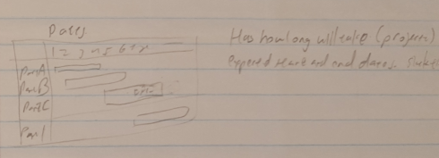

**Software Engineering:**

What is software engineering?  In other words, what is this course really about, and how does it differ from courses about topics such as data structures and algorithms?

        	Software engineering deals with planning and implementing large, user-friendly, well-documented, robust, expandable systems as part of a team. Different from DSA because documenting, plan for expansion, plan for robustness, user-friendly. Example: Validate input, plan for user stupidity. Has to be easily usable to build upon. Don't want to start from scratch.

** ****Wasserman:**

In 1996, Wasserman listed what he considered to be seven key changes in the field of software engineering. What did he mean by these changes?

          7 Key Changes

1.       Commercialism – errbody gots PCs

2.       Lower hardware costs, higher maintenance cost

3.       Powerful desktop computing as opposed to mainframes

4.       Extensive networking 

5.       Object oriented technology

6.       GUIs - command prompt ascii art

7.       Unpredictability of the waterfall model

Wasserman has suggested that there are eight fundamental notions that form the basis for an effective discipline of software engineering.  What do these mean, and how is it beneficial?

          8 Fundamental Notions

1.	Abstraction 

2.	Analysis and design methods and notations - UML - having a standard notation, being able to use it to check completeness and consistency

3.	User interface prototyping - users happy or unhappy based on interface

4.	Software Architecture - overall architecture of a system important for ease of implementation and testing and for speed and effectiveness of maintenance and change

5.	Software Process - model of the process

6.	Re-use - use things from previous guys

7.	Measurement - quantitative description of where we are and where we’d like to go

8.	Tools and integrated environment - IDE’s and stuff are cool and make it easier for me to code stuffs 

 

**Fault, Bugs, Failure:**

We have learned that our textbook does not use the term "bug" when referring to problems with a software system. What is a software fault?  What is a software failure?

Faults are problems with the code/design of the system - doesn’t happen, exists

Failures are deviations from expected result/incorrect behavior - something that happens, bad result

**Models:**

Process Model

What is meant by the software life cycle? When does it end?

Software development process, life of a software product from conception to implementation, delivery, use, and maintenance. It never ends?

	

In the context of software engineering, what is a process model? Are the process models that we discussed in class prescriptive or descriptive (explain your answer)?

A model of a series of steps involving activities, constraints, and resources that produces an intended output of some kind.

Prescriptive: give advice or requirements of what you should follow - what should happen

Descriptive: investigate procedures that are actually implemented at a company, examine and describe that, and follow that - what actually happens

Phased Developments

What is phased development and why might this be beneficial?

Developing software in 2 concurrent versions, where one is currently being used while the other is being worked on and developed and being prepared to replace the one currently in use

We have learned that phased development often involves both a production system and a development system. What are the meanings of these two terms (production system and development system)? Specify a major advantage of this type of approach?

	Production system: the version currently in use

	Development system: the version being prepared to replace the production system

	Incremental developer adds new functions to each release. 

Iterative developer improves existing functions.

	Advantage: reduce cycle time, which is the time from requirements to delivery

V-Model and Waterfall 

What are the stages of the waterfall model of software development?  What is the major drawback of this model?

* Requirement analysis (talk to customers, collect requirements, write specs)

* System design (high level design- what system architecture, what components to use, is documented)

* Program design (flowcharts, lower level pseudocode)

* Coding (the actual code)

* Unit and integration testing (test each class/procedure and interactions between parts)

* System testing (test system as a whole)

* Acceptance testing (test on customers’ machines - are they satisfied?)

* Operation and maintenance (keep system active and customers happy)

Drawback: requirements change, often process does not go so linearly, documentation takes time, hard to plan so far ahead 

Example: DLD

Requirement analysis: Send proposal to Risbud

System design: First documentation and parts list, explanation of how project works

Program design: Design project in Logisim 

Coding: Physical building

Unit and integration testing: Test each part of project and if they work together

System testing: Test if everything works

Acceptance testing: Show to Risbud

Maintenance: End of Year Show + Display case

Was the waterfall model descriptive or prescriptive? Briefly explain your answer.

	Prescriptive: told what people should follow before the process started

How did the V-model of process development improve upon the waterfall model?

After Coding, goes up and do each stage of testing along with more changing of earlier steps--this is more realistic, need to fix things in earlier steps later on all the time

**Prototyping:**

What is prototyping model? What are advantages of prototyping?

	At each step you send to the customer for review and revise accordingly. The customer feels more involved in the process and will be happier. Smaller chance of having to completely change earlier parts later on because of misunderstandings or changes in requirements

**Ariane-5:**

What was the Ariane-5 and what happened to it? According to the team that investigated it, name one way that the Ariane-5 disaster could have been prevented.

	Ariane-5 was an European rocket that self-destructed after launch because of a fault in control software. In a module that was only supposed to be used for calculation during liftoff, conversion from a 64-bit integer to a 16-bit signed integer. The lack of an explicit exception handler crashed the entire software.

Mentioned because mistakes were overlooked at every stage "without fault." It was not a result of incompetence (followed standards), not a software management problem (testing and validation problem), nor a testing error (this was the test launch). It was a result of a reuse error; the SRI horizontal bias module was reused from a 10-year-old software, the software from Ariane 4. Lesson: Do not reuse without contract. 

**Risk:**

In terms of software development, what is risk? Related to program management, what is meant by risk management? What are the three possible strategies to deal with risk?

	Risk is a potential unwanted event that has negative consequences. (Software)

	Risk management - dealing with risk probability, risk impact, risk expense

3 Risk Reduction Strategies

1.  Avoiding the Risk - aka change requirements

2.  Transferring the Risk - get insurance

3.  Assuming the risk - ignore it 

4. Condoms - use it (don’t throw it in the recycling, put it in the trash can!)

According to our textbook (and other sources), a safety-critical system should have a reliability of 10-9. What does this mean, and why is it so difficult to guarantee?

	Any system that deals with safety. Reliability is hard to guarantee in large systems.

Reliability 10-9 – one failure every 109 hours of operation 

**Quality:**

In class, we discussed four strategies that our textbook recommends for preserving design quality in your code.  Describe them. 

	Localize input and output - Since it’s most likely to change, reduce dependency

	Including Pseudo Code

Revising and Rewriting. Not patching 

Reuse 

Program Documentation

Meaningful Variable names and Statement Labels

Formatting to enhance understanding

In class, we discussed five philosophical views of how to evaluate the quality of a product (including software products). Explain them.

Views of Quality - Philosophical

-          Transcendental view: if people like it or not, can’t pinpoint what they like about it

	- (Inherent, people know. Hard to pinpoint)

-          User view: products that best satisfy the user preference

-          Manufacturing view: does the system created meet the requirements given

-          Product view: look at the product and see how well it’s made (well written code)

-          Value-based view: how much are people willing to pay for it

**Object Oriented:**

Related to object-oriented development, briefly explain each of the following terms: encapsulation, information hiding, inheritance, and polymorphism.

Encapsulation: Everything you need to know about an object is contained in the class

	Information hiding: mix of public, private, protected functions

Inheritance: can define classes that derive from existing classes and inherit their characteristics

Polymorphism: calls the correct methods based on what kind of object it is (if you have two functions of the same name that do different things for different kinds of objects, polymorphism automatically chooses the right one)

Related to object-oriented design, explain the terms white-box reuse and black-box reuse.

We have defined seven characteristics of object-oriented representations; name and define three.

**Agile:**

We have learned that the agile manifesto, written by software engineers who opposed the rigor of existing process models in the late 90s, includes four tenets.

Four Tenets of Agile Manifesto

	- value individuals + interactions (invest in interactions) 

	- Invest time in working software rather than excessive documentation

	- favor customer collaboration instead of contract negotiations (trust each other)

	- Concentrate on responding to change rather than creating a plan and following it

We have learned that one of the agile methodologies is extreme programming (XP) focuses on five characteristics of agility, a.k.a. values. Our book only lists four (communication, simplicity, feedback, and courage). The fifth one is newer; what is it, and what does it mean?

5 Characteristics/Values  of XP (Extreme Programming)

	- Communication (between programmers and customers directly)

	- Simplicity 

	- Courage (commitment to delivering new software quickly and efficiently)

	- Feedback  (from customers, as you go, frequently)

	- R.E.S.P.E.C.T. find out what it means to me! (among everyone) 

Respect was the 5th newest tenet added because (the song came out)

12 Facets/Practices of XP

1.  the planning game- generate map of releases from customers’ "stories"

2.  small releases - get stuff out to the customer really fast (weeks not years)

3.  metaphor- agreement between customers & devs about terminology

4.  simple design - deal with features of the code that you currently want (screw changes)

5.  writing tests first - to avoid bias from already written code

6.  refactoring - change code without changing behavior of software (improve eff) don’t change the API (implementation)

7.  pair programming - two people code like gay love buddies (now you can waste 75% of                  time for two people at once) you have to have someone to hold your dick 

8.  collective ownership - everyone knows all the code because communism

9.  continuous integration - small changes from release to release

10.  sustainable pace - be lazy, don’t work too much - don’t work >40 hrs/wk

11.  on-site customers - customers physically interact with their coding bitches

12.  coding standards - the code should look like it was written by one person

What were the creators of the agile manifesto rebelling against?

	The rigidity of the waterfall method and excessive documentation

What do proponents of extreme programming claim is good about it?

	It’s called extreme programming, what more do you need

Assume that a programmer is working at a software company that requires its employees to use the extreme programming methodology. One employee has been working especially hard one week trying to fix a problem with a soon-to-be-released system. At the end of a long, tough week, late at night, he thinks he realizes a way to fix the problem. He remotely logs into his system, tries out the fix, and solves the problem. Specify two rules (a.k.a. practices or facets) of extreme programming that this employee has violated.

	Can’t work too long, can’t work alone

aka (Didn’t have someone looking over his shoulder holding his C++ and burnout?)

**Project Schedule:**

In an activity graph, what is indicated by the nodes, and what is indicated by the links?

	Nodes: milestones

	Links: activities (to get to the milestones)

	An activity graph is useful since it is easy to find the critical path.

What is a Gantt chart?  How does it differ from a CPM bar chart?

The critical path method (CPM) is the analysis of the activity graph to see which steps

can be done in parallel/concurrently - activity graph + time.  The CPM bar chart (Gantt chart) represents which paths can slip and by how much without affecting the finish date - activities vs time with importance rating. The Gantt chart includes 

	Real time: how long it’s expected to take

	Available time: how long you have to complete it

	Slack time (F): time in between

The dashed vertical line splitting up the bar chart indicates "today" i.e. where you’ve gotten so far and what’s left. It includes completed, expected duration, floating time, critical time, slippage, start task and finished task markers. Horizontal bars of varying lengths represent the sequences, timing, and time span for each task. However it does not indicate task dependencies.

	

**Project Plan:**

What are components of a project plan? 

	Project scope

	Project schedule

	Project team organization

	Quality assurance plan

	List of documents that will be produced

	Testing approach

	Security plan

What sorts of information does a project plan communicate to customers and other stakeholders?

	What you’re supposed to get done, how, and when. 

As part of the discussion of a successful software engineering project, the textbook introduced the term "cusp" (and we talked about it in class); what does this mean, and what was the suggestion related to it?

Cusp - anything that risks reaching a milestone

**Project Management:**

With regards to program management and organizing teams of programmers, what is meant by the egoless approach?

No hierarchy- for each product there’s a group of programmers who can all work on everything

In class, we discussed two ways to organize teams of programmers; briefly explain each of them.

	Chief programmers team: hierarchical- one programmer in charge with underlings

	Egoless - minimize personal factors to improve quality (an orgy of programmers where anyone can work on anything)

In class, we discussed 3 methods of estimating the cost of a software project.

	- Expert Judgement - talk to experienced people and predict cost

	- Algorithmic - analyze data and come up with formula

	- Machine Learning - train on prev. examples and get a cost estimate

Actual Quiz 2015 Answers:

1. Robust means it can handle outlying cases and won’t crash. It plans for non-ideal input, i.e. plan for user stupidity. (Instructor comment: better example, assuming proper input format) Many times we didn’t check or retry on file error openings which would be a reprompt in a professional system. (Instructor comment:you should probably check ??? this exam in DSA) 

2. Software fault: Sending unintended wrong variable to a function in the code
Software failure: The software crashes from an overflow

3. Unanswered 

4. Waterfall model is prescriptive. Tells you what to do. In general a model is prescriptive since it provides a format. Some models can be more descriptive, i.e. closer to what happens. Vmodel - means what happens in soft dev more since there are backtracks (Instructor underlines and comment:Still more prescriptive than descriptive) 

5. Both models contain the same elements. The waterfall method is a one way track. It doesn’t allow for revisions or change. The V model bends the waterfall method in half so you can return to the requirements, designs, and planning steps on 11 levels. (Instructor underline) 

6. Prototyping is a process of showing the the models (Instructor comment:or code, UI, etc)  for approval along the way and building first proof of concepts, making sure it works. It can save you time and effort if it doesn’t work or if the customer didn’t like what was developing.

7. Courage to (Instructor comment: commit) to put out frequent releases. Don’t be afraid of releasing work and sharing it.

8. Unanswered

9. The critical graph method is taking (Instructor comment:or verifying) the activity graph milestones, outlines, nodes and links, and assigning a time and importance to them. Makes a bar graph (Instructor comment:or determines critical paths, what can be done in parallel) 

10. The egoless approach has a flat hierarchy; anyone is allowed to work on any part of the software

11. Machine Learning - Iterate and try to better model cost
Ask experts to form a cost
Build a formulaic representation

12. Prof mentioned that EXCEL was millions of lines of code. (Instructor comment:some programs today have tens of millions or more)

Points off: 0?

