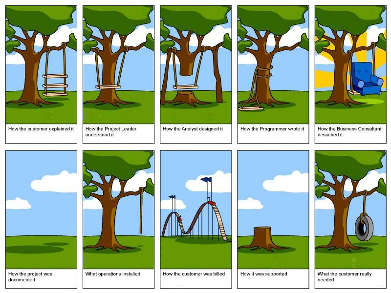
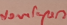

**Software Engineering**

**Requirements:**

	A requirement is an expression of desired behaviour. 

Two Phases

1. Specification phase: Decide requirements; specify what each system is supposed to do

2. Design phase: Plan how each specific behaviour will be implemented

Capturing the Requirements

·         Elicitation – Collecting the user’s requirements

·         Analysis – Understanding the behavior

·         Specification – Documenting the software system

·         Validation – Check to make sure everything matches

·         Product: Software Requirements Specification

Four types of requirements:

*In class, we have learned that there are four main types of requirements. What are they, what do they mean, and what would be an example?*

1. Functional requirements: required behavior in terms of required activities 

    1. (what must it do), i.e. for payroll system, input needed to print a check

2. Quality requirements: quality characteristics must have

    2.  i.e. ease of use, reliability, low maintenance cost, high response time

3. Design constraints: design decisions that restricts the set of solutions such as platform

4. Process constraints: restrictions on techniques or resources 

Eight desirable properties of good software requirements:

1. Correct: Both parties accept and agreed that correct 

2. Consistent: No conflicting requirements

3. Unambiguous: Only one valid interpretation 

4. Complete: Specifies required behaviour and output for all possible inputs in all possible states under all possible constraints

5. Feasible: Does there exist a solution that meets the criteria

6. Relevant: Make sure restrictions and requirement are relevant to the functions needed

7. Testable: Must suggest acceptance tests devised to check if requirements are met

8. Traceable: Are the requirements accessible, organized, and uniquely labeled 

*Which groups of people are involved in the elicitation of project requirements?*

Requirement analyst or Systems analyst designs the requirements. Clients are paying and have final say. Customers buy the software. Users who will use the system. Domain experts brought in for consultation on the problem. Market Researchers determine the market and needs. Lawyers and Auditors make sure it adheres with laws. Software engineers or tech experts make sure it's feasible. 

**Documentation:**

*In class, we have often expressed the importance of documentation.  Name and briefly describe the two major documents produced during requirements gathering. **Why is it recommended to create two main types of requirements documents as opposed to just one?*

Note: The two major/main types of documents are the requirements definition and requirement specification. One for customer one for dev, must agree

1. Requirements Definition: (must be approved by customer) Complete listing of everything the customer wants to achieve. Include general purpose and scope, background and rationale, operating environment (different software it will interact with), proposals, and assumptions 

* General purpose/scope

* background rationale

* core functionality and quality requirements

* environmental operating conditions (OS, hardware)

* customer advice (revaluation)

* assumptions

* Customer not happy? Well they approved the requirements info, so SMD

2. Requirements Specifications: Restates requirements as specifications from Dev point of view. Includes documentation about the interface, all inputs and outputs, details on all the required functionality, and devise fit criteria for quality requirements.

* Interface documentation (appearance, functionality)

* All I/Os

* Details and required functionality

* Fit criteria for evaluating quality requirements

*With respect to requirements verification, what is meant by traceability?*

	Establish links between software development entities, customer views to developer views so that relevant developments are linked, i.e. by numbering system. Theoretically if a requirement changes, any specifications, designs, implementations, and verifications developed that relate to that requirement can be identified.

*With respect to requirements gathering, what is validation and what is verification? *

Validation of requirements: (build the right system) check if requirements reflect customer’s needs

Verification of Specifications: (build the system right) check if on all levels consistent.

	

**Diagrams**

·         Interaction Diagrams – How objects interact

·         Sequence Diagrams – How messages flow

·         Communication Diagrams – Same information but from an object diagram

·         Activity Diagrams – Describe operations

·         State Diagrams – Show states an object can take

**Decomposition:**

*Related to system design, what is decomposition and why is it important? In class, we discussed several variations of the traditional decomposition approach to software design. *

	Design by decomposition iteratively divides a system’s element from top-down into its constituent parts and describing their interfaces.

1. Functional decomposition: Partitions functions or requirements into modules 

    1. Top Down Design

    2. Structured programming

2. Feature oriented design: Method of functional that assigns features to modules

3. Data oriented decomposition: Method focuses on how data will be partitioned into modules 

4. Process oriented decomposition: Partitions system into concurrent processes 

5. Event oriented decomposition: Focuses on events that systems must handle and assigns responsibility for events to different modules 

6. Objected oriented design: Assigns objects to modules

**Architectural Styles:**

Design – Figuring out how to implement the system

Architecture – How to decompose the system into its parts

Existing Solutions

·         Cloning – "Borrow" an existing design and make modifications

·         Reference Model – Generic architecture for a type of application

Process

·         Modeling, Analysis, Documentation, Review

·         Product: Software Architecture Document

Decomposition Views** **– see above

Architectural Views

·         Decomposition View – Breaks a system down to its parts

·         Dependencies View – Shows how software components interact with each other

·         Generalization View – Shows how generalizations of components interact

·         Execution View – Shows the runtime structure of a system

·         Implementation View – Maps code units to modules and objects

·         Deployment View – Maps runtime entities together

·         Work-Assignment View – Decomposes the system design into tasks that can be assigned to teams

**Design Techniques**

Layering – Each layer can only access the components under it

Cohesion – Each unit will contribute only to that unit’s purpose

Coupling – Each unit will not affect other units

Reliable – Performs the expected functions under assumed conditions

Robust – Able to function correctly under stress and invalid inputs

	(Perspectives for viewing a system)

* Pipe and Filter System: Parsing data through a series of filters

    * Pass input data through data-transforming components called filters to produce output data. Pipes are connectors that simply transmit data from one filter to the next.

* Client Server: Servers offer services while clients access them via reply/request protocols.

* Peer to Peer (P2P): Each process act like client or server

    * Each component executes its own process and acts as both client and server to other peer components. Data is stored locally and system scales well.

* Publish Subscribe: Reacting to events and requests

    * Components interact by broadcasting and reacting to events. A component can subscribe to an event and when another component publishes, announces event has taken place, the subscriber components are notified. Implicit invocation is a common form of this where a subscribing component associates one of its procedures with each event of interest called registering the procedure. 

* Repository: Central data storage and associated data accessing components

    * Challenging to design. For example a traditional database, data store is server component while client queries interact with the data. Since data-accessing components initiate system computations, they are active. A blackboard type of repo is reactive, data-accessing components execute in reaction to current contents of the data store. 

* Layered Systems: Layers provide services to layer above them and clients to layer below. Layer bridging relaxes constraints and allows layers to access below its lowest neighbor.

**Design Patterns**

*Why is it considered useful for software engineers to study design patterns?*

	Codifies (materializes, makes tangible) design decisions and best practices. Creates a reversible template for a solution you can modify and adopt for systems

* Template Method Pattern – Define abstract primitive operations and then subclasses override to realize subclass specific operations

* Factory Method Pattern – Encapsulate code to create objects

* Strategy Pattern – Allows algorithms to be selected at runtime since the best is not known until it is running

* Observer Pattern – Application of publish-subscribe

* Composite Pattern – Collection of objects that represents a composite entity

**Interface/Object Composition**

*Briefly explain a situation in which you might need to choose between using inheritance and object composition (and how each would work).*

If your project requires multiple components of a similar type, inheritance can be used to create classes that inherit common functionality from a base class, for example cars/trucks/buses inheriting from vehicles and then use composition if you have individual components that you want to reuse in distinct classes, for example using the same engine in a car and a boat and a lawn mower

*Related to object composition, we discussed in class a guideline known as the Law of Demeter. What does this recommend? *

"Don’t talk to strangers" Principle of Least Knowledge. Design to interact with friends who you have limited knowledge about internal workings, but only talk with immediate friends

**Exception Handling**

*Name an advantage of using exception handling as opposed to some other form of error checking.*

Exception handling keeps all error checking code localized in one spot as opposed to error checking within each function.  It can help with functions because a function can throw an exception instead of returning an error value that you may want to use, say a str to int function.

*We have stated in class that software should be designed to be reliable and robust. What do each of these terms mean? Related to a software system, briefly define reliability and robustness?  For which of these properties is exception handling useful?*

Reliability: The system behaves correctly under proper conditions

Robustness: The system behaves reasonably under improper conditions

	Exception handling is useful for Robustness.

---------------------------------------Questions pertaining to Quiz 2------------------------------------------

**UML/ER:**

What are the three core constructs of entity-relationship (ER) diagrams?  Which component of UML is a specific type of ER diagram?

ER has three core constructs: entities, relationships, and attributes.

	Entities: Rectangles representing a collection of real-world objects that have common properties and behaviors.

	Relationships: Edge between two entities with a diamond in the middle of the edge specifying type of 

relationship

	Attribute: Annotation on entity that describes data or properties associated with the entity

Without listing its sub-components, briefly explain the purpose and the importance of the Unified Modeling Language (UML).

UML is collection of notations used to document software specifications and designs. Represents systems in terms of objects and methods. Objects are like entities and are organized into classes that have an inheritance hierarchy. 

Class diagram is an ER diagram relating classes (entities) in the specification. Boxes are classes, having a name, set of attributes (simple data variables that aren’t classes), and set of operations on the class’ attributes.

Class-scope attribute, underlined attribute, is a data value shared by all the instances of the class. Class-scope operation, underlined operation, is an operation performed by the abstract class. 

Association, line between two classes, indicates a relationship between two class’ entities. 

Aggregate associations, drawn as association with a white diamond on one end 

Event trace is sequence of events that are exchanged between real-world entities. Vertical line represents timeline for distinct entry. Horizontal line represents event or interaction. Time goes from top to bottom; upper happens first. Each graph depicts a single trace which only shows one of many possible behaviors. 

Message Sequence Charts are enhanced event-trace notation, containing entities, message, actions

We have learned about four types of relationships between classes.  Name and define two. (ER)

We have learned that a system can then be defined in terms of activates, entities, relationships, and a definition of the boundary of the system. What is the definition of "boundary" in this context?

Dependency

Association

Generalization

Extensibility

A conceptual boundary used to group logically related elements from a visual perspective

Which notation from the Unified Modeling Language (UML) is also considered a type of Entity Relationship (ER) diagram? How does this notation differ from a general ER diagram?

See fundamental notion number 2

What is the purpose of a UML statechart diagram?

Explain what the ovals represent in a UML use case diagram.

What is the purpose of the Object Constraint Language (OCL), what is it used for, and how is it incorporated into UML?

Related to UML use-case diagrams, what do the stick figures outside of the boundary box represent?  What do the ovals inside the box represent?

Name and briefly explain the purpose of 3 components of the unified modeling language (UML) that are used during the requirements gathering phase of software development.

Related to the Unified Modeling Language (UML), what is the general purpose of message sequence charts (a.k.a. sequence diagrams)?

Three types of components in use case diagrams are represented by a large box, stick figures outside the box, and ovals inside the box. Name and briefly explain these three types of components. (UML)

Which notation from UML is also considered an extension of an event trace? How does this notation differ from a general event trace?

What do vertical lines represent in UML message sequence charts (a.k.a. sequence diagrams)? What do arrows between vertical lines represent?

We have discussed four types of interaction diagrams (all of which are components of the UML).  Name and briefly explain the purpose of any one.

UML class diagrams: Show how a class interacts with actors

Related to UML class diagrams, we have learned about four types of relationships between classes.  Name and define two.

What is specified in each of the three sections of a class box in a UML class diagram?

In UML class diagrams, what is indicated in each class box?

What is the purpose of an association class in a UML class diagram?

What is a Software Architecture Document (SAD)?  (Don't be too specific listing its parts.)

In class, we discussed reference models, and discussed an example of one for compilers. How does a reference model differ from an architectural style?

OO Stuff

In class, related to object-oriented design, we discussed the concept of dependency inversion. What does this mean and why can it be useful?

Dependency inversion = literally what it says

	Parent is now reliant on child/branch

Related to object-oriented programming concepts, what is meant by persistence?

Related to inheritance, what is meant by substitutability?

	Parent modules can be subbed or replaced by its child

**Designing the Modules**

Design Principles – Guidelines for decomposing the system’s required functionality into modules

Related to the design of software modules, what is meant by an interface?

Interface defines what services the software unit provides and how other units can access those services. 

Related to software modules, what is coupling, and why is loose coupling considered more desirable than tight coupling? Without listing the types of each, briefly explain the concepts of coupling and cohesion.

Coupling – tight/loose, how interrelated modules are (tight = bad) measures interdependence

Cohesion – how highly pieces within a module relate to each other (high = good) dependence within and among module’s internal components

*In class, we described three types of dependencies (or component couplings) that can link components of a software system.  Name and define two.*

* Content: one module can change another

* Common: modules share common data

* Control: one module completely controls what other modules do (eg switch case to other modules)

* Stamp: pass complex objects from one module to another

* Data: pass simple values from one module to another

* No coupling: totally unrelated

Types of cohesion: (lowest/worst to highest/best)

* Coincidental: lots of stuff that doesn’t relate to each other

* Logical: only parts are related (eg by if statements)

* Temporal: routines expected to exit at around the same time

* Functional: all elements related to a certain function are placed in the same module

* Informational: functional applied to obj. oriented design (also within classes, etc)

*What are the two main purposes of a design review?*

*What is a design review and what is its purpose?*

	Get people together and review the design; the sooner bugs are caught, the easier/cheaper they are to fix;

Evaluate SAD, verify design (does it meet requirements?), validate (is it well designed)

**Databases**

In class, we listed eight advantages of using a database management system (DBMS), as opposed to writing applications-specific code.  Explain four advantages.

* Security: Control who has access to what data and who can modify it

* Concurrency: Allow multiple users to access the data

* Reduced Development Time: don’t have to spend time writing data management code

Related to relational database management systems, what is a key (e.g., a primary key)?

Unique identifier (primary).

In a relational database, what is a foreign key?

Entry does not have own uniqueID, but a relationship to outside entry identifies it. 

*We have learned that two main components of the Structured Query Language (SQL) are the data definition language (DDL) and the data manipulation language (DML).  Briefly explain what each of these components provides.*

DDL: define what database can store, create tables and views

DML: insert, modify, and query the data

*When specifying a foreign key in a table definition in SQL, what is meant by the phrase "ON DELETE CASCADE"?*

If delete entry that has foreign key, then also delete referenced obj

Related to relational database management systems, what is a relation?

Entities and connectors different kind of tables?

For a relational database, what is the conceptual schema?

	Diff parameters of relation

Related to the relational data model, what is specified by the schema of a relation?

Specifies fields?

What is meant by an instance of a relation?

Relation defined by schema, instance is the data

--------------------------------------------- NOTES

Entities-Relationship

Message-sequence chart

* arrows represent messages

* dashed arrows = create events, indicates that an entity is created

* cross at bottom = point at which the entity is disposed of

* rectangles = actions along the way

* labeled hexagons = conditions

UML state chart diagram (UML state machine)

* States and transitions with effects

* Superstate

Data flow diagram - indicates the paths data takes between objects

* actors

* data baths

* process

* data flow

UML use case diagram - indicates how users(actos) interact with the system

* box = system boundary

* ovals in box = use cases; i.e. required functionality

* lines link actors to use cases

**use case** is a list of steps, typically defining interactions between a role (known in Unified Modeling Language (UML) as an "actor") and a system, to achieve a goal. The actor can be a human, an external system, or time

blah blah formal math grounded skip formal book mentions decision tables UML basically table rows inputs columns happen checks input happens you know formal models um still somewhat visual in software documentation but they still exist

**Logic**

* First order - used for NLP; eg num_coins > num_entries => unlock turnstile

* Temporal logic - sucks

* OCL (see below)

**Object Constraint Language**

* designed separately from UML to concretely specify model attributes

* de facto standard for UML

* OCL statements are constructed in four parts:

1. a context that defines the limited situation in which the statement is valid

2. a property that represents some characteristics of the context (e.g., if the context is a class, a property might be an attribute)

3. an operation (e.g., arithmetic, set-oriented) that manipulates or qualifies a property

4. keywords (e.g., if, then, else, and, or, not, implies) that are used to specify conditional expressions.

**Specification and Descriptive Language (SDL) - **alternative to UML, not common

Summary of notations used for requirements UML break today

* Use case diagrams (data flow diagrams)

* UML class diagrams (entity relationship)

* Message sequence charts (event traces)

* State chart diagrams (state machines)

* Object constraint language (logic add-on)

--- UNRELATED

Java Doc

Related to Javadoc, what is a doc comment?

Related to Javadoc, what is a doclet?

svn+ssh://199.98..<ip_address>/home/cooper/class)repos

New Repo Location

login with cooper

Not in Quiz?------------------

We have discussed several strategies for preserving design quality in code.  One was to take advantage of producer reuse and consumer reuse.  What do each of these terms mean?

When discussing strategies to improving code quality, one of them was to localize input and output. Why is this generally recommended?

Name a benefit of using design by contract when designing and documenting modules.

Related to design documentation, briefly explain the notion of design by contract.

(11)	Related to actual code, what is meant by control structures?

(12)	What are the meanings of producer reuse and consumer reuse? Which one provides short-term gains and which one provides long-term gains?

Actual Quiz 2015 Answers:

1. Quality requirements dictate standards that software will have to uphold, like how fast it runs

2. Process constraints are limitations dictated by process, what is needed
An example is that if input comes in as mp4 files, the program has to decode mp4 files (Instructor comment:I don’t think this example is a process constraint, it is a required feature, functional requirement. Example: use a programming association) Points off: -2

3. Like in an ER diagram, it represents a link, relation. The text indicates how they will react with each other. At the ends it specifies how it links together. (Instructor comment:Text in middle is ???; at ends, refs names or multiplicative) Points off: -4

4. The large box is the boundary of the system and signifier that everything is relevant to the program. (Instructor comment: specifies what  need to capture)

5. Requirements Def: for customer  (Instructor comment: check), details like what os used, etc
Requirements Spec: for dev  (Instructor comment: check) how the program will be implemented  (Instructor comment: functionality) and how they will interact  (Instructor comment: technical details) 

6. Soft arch refers to how the sys is designed and how it’s org and laid out Unanswered

7. Decomposition refers to breaking down the program/software specs into smaller bits in order to determine what groups together

8. Pine-filter: audio/video file -> processed -> sent to speaker/monitor, info -> pipe moves -> filter processes  -> pipe moves -> filter processes -> output, package transport and processed at storage warehouse until delivery
Publish-substitute: New subscription. When article comes out, push notif to email/phone
Layering: Info passed through layers which can only interact with layers below, file-> transmitted to satellite-> to receiving station -> satellite -> station -> over ISP -> computer

9. Coupling is how interdependent  (Instructor comment: ✔) modules are (want low coupling) 
Cohesion is how related (Instructor comment: ✔) the inner parts of modules are (want high cohesion)
Uncoupled modules don’t rely on each other and don’t affect each other. High cohesion means that each modules has its own job.  (Instructor comment: ✔)
Important to think about because it organizes programs. Don’t want changes to one part to break many parts and don’t want large misc ordered files that have all sorts of unrelated functionalities

10. Composition - shared general attribute  (Instructor comment: This assumption does not really describe composition)  allows for general standard  (Instructor comment: preserves encapsulation) Points off: -3
Inheritance - derived from parents allows for easy grouping and understanding of related classes

11. Design so the program chan choose best algorithm  (Instructor comment: for a specific task)at runtime depending on input

