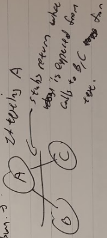

**Code Quality**

*What has empirical evidence shown about the effects of reuse on code quality?*

	

*In class, we discussed several strategies that our textbook recommends for preserving design quality in your code.  Name and explain three.*

* Keep the code modular - split code into modules, don’t put everything in one place

* Keep the code general - don’t hard-code numbers etc., give configurable parameters

* Localize input and output - user interface code typically in one module

    * Since it’s most likely to change, reduce dependency

* Use pseudocode in pre-coding stage (Sable doesn’t think this is usually true)

* Consider refactoring - for readability/better structure or new features

* Take advantage of producer & consumer reuse - use/make libraries

Revising and Rewriting. Not patching

 Reuse 

Producer reuse: keep in mind while writing code that you may want to reuse it in the future - document, archive, comment

	Customer reuse: use libraries and code that have been used/written in the past 

Program Documentation

	Internal Doc - eg comments

	External Doc - eg manual

Meaningful Variable names and Statement Labels

Formatting to enhance understanding

**Open/Closed Box**

*What is meant by close box (a.k.a. black box) testing versus open box (a.k.a. white box) testing?  *

Open box: you look at the code when you create the tests (usually when the coders are also the testers)

Closed box: you don’t see the code when you write the tests (when there’s a separate testing team)

*What is an advantage of each?*

Open box: can test *all* the code, won’t miss lines that you haven’t realized are there, won’t just look at the outcome

Closed box: unbiased, won’t code based on what you know will happen, aren’t influenced by the actual code and distracted or under a false misconception of what’s supposed to happen

**JUnit**

*JUnit was created by Erich Gamma and Kent Beck.  Each of these developers is also well known for something else about which we have learned.  What are these other things?*

	Erich Gamma: Gang of 4: Design patterns, (something about Eclipse (JDT))

	Kent Beck: Extreme programming

*Gamma and Beck wanted to have "some glimmer of hope that developers will actually write tests"; how does their design of JUnit make this more likely?*

Make it simple, with very little code, to write tests so they’ll actually do it--same language, no extra effort than absolutely necessary

*The designers of JUnit wanted to make it easy for Java developers to create tests. What design decision did they make in order to achieve this goal?*

Already integrated in the Java environment, in the same language they were developing with 

*The creators of JUnit claimed to have three major goals; name two.*

-Have some glimmer of hope that will actually write tests

-Tests should retain their value over time

-Should be reusable- it should be possible to leverage existing tests to create new ones

*According to JUnit terminology, what is a test case and what is a test suite?*

	Test case: a single thing that you’re testing (eg one math equation)

	Test suite: testing the whole system - collection of test cases (eg whole set of equations)

*Related to JUnit, what is meant by setup, or fixture, code?*

In a test suite, it’s the code that is common to all the test cases, so you initialize certain variables so you don’t have to write them each time (eg want to test 12+5, 12-5, 12*5, 12/5 → initialize 12 and 5 at the beginning)

**Faults (pg 401)**

*Our textbook does not use the term "bug". What two related terms to they use, and what do each of the terms mean? We have learned that our textbook does not use the term "bug" when referring to problems with a software system. What is a software fault?  What is a software failure?*

Faults are problems with the code/design of the system - doesn’t happen, exists

Failures are deviations from expected result/incorrect behavior - something that happens, bad result

*We learned that one method of estimating the number of faults remaining in a system is called fault seeding, a.k.a. error seeding. What does this mean?*

	Let devs add in faults and keep track. Use % found to predict total #

*We have discussed several types of faults that might exist in a software system; name  and define four.*

* Syntax fault: wrong usage, missing colon etc. compilers usually catch 

* Algorithm fault: actual logic of algorithm doesn’t work, eg break instead of next, each line does what you want but whole code doesn’t because of specific cases, forgetting to branch, test conditions wrong et. Desk checking, aka submit data and see if right output

* Computation or precision fault: wrong implementation of a formula or improper consideration of precision

* Documentation fault: docs don’t match what func does

* Stress or overload fault: when it’s possible to fill up a data structure beyond its capacity (eg overflowing an array)

* Capacity or boundary fault: not able to handle many users

* Performance fault: Does not meet timing/speed requirements

* Recovery fault: system doesn’t recover from unexpected failures 

* Standards or procedure fault : doesn’t conform to company’s standards

*What is the meaning of a computation fault, a.k.a. precision fault, and why do they sometimes occur?*

	PacMan... ? Conversion faults, loss of precision, formula’s implementation is wrong, etc ARIANE-SCHFIFTY FIVE

*Three types of faults that we discussed in class are syntax faults, algorithm faults, and computation (or precision) faults. Briefly explain a specific example of each.*

Syntax Fault: Forget a semicolon;

Algorithm Fault: Putting a less than instead of a greater than in a condition of an if statement.

Computation fault: Pacman only has 255 levels.  Upon completion it goes to level 256(the boundary of an 8 bit unsigned integer) and the overflow error causes problems.

*	*

*According to a study cited by our textbook, which recommended technique tends to find the most faults in code?*

*	*Code review 

**Integration testing**

*State one reason that integration testing can be more difficult for object oriented systems.*

-Inheritance, polymorphism, and dynamic binding make testing more difficult

-interaction between objects is complex, must take into account object states

-Objects and classes should be tested for excesses and deficiencies 

*Related to integration testing, explain the difference between a bottom-up approach and a top-down approach.*

	-Bottom-up-  the lowest level components are tested first, then used to facilitate the testing of higher level components.

	-Top-down- top integrated modules are tested and the branch of the module is tested step by step until the end of the related module

*Related to integration testing, what is a component driver and what is a stub, and with which approach to integration testing is each necessary?*

	-Driver- the piece of code that passes test cases to another piece of code (bottom up)

	-Stub- dummy procedure, module or unit that stands in for an unfinished portion of a system (top-down)

**Code analysis tools** (evaluate code quality)

* Static analysis tools - analyze code while code isn’t running

* Dynamic analysis tools:

    * program monitors: watch program while it’s running, keep track of things like memory usage, CPU usage, speed, etc

    * debuggers

    * profilers - see when code/functions get run

**System testing**

*We have learned that system testing includes four types of tests.  Name and define two.*

-function testing - tests functionality

-performance testing - tests quality requirements

-acceptance testing - does the user like it

-installation testing - can you install it right

*What sort of documentation is created while system testing is taking place? In addition to the test plan, name and briefly describe any one type of documentation that is related to system testing. *

	Test plan - describes the testing system and plan for implementing all functions

Test specification and evaluation - details each test and what it’s testing for

Test description - presents test data and procedures for individual tests

Test analysis report - results of each test

*What is the purpose of a test plan? Explain three components of a test plan.*

Test plan: include state of purpose, what does test ensure, ref to other docs, has test schedule, description of major tests

*Name and define three types of performance tests.*

* Stress tests: testing things like maximum number of users using something at once. Deals strictly with users

* Volume tests: tests the size of data, data incoming

* Configuration tests: function testing for different configurations

* Timing tests: if there are requirements for efficiency it’s tests for runtime

* Quality tests: testing guarantees of the system. Reliability and 

* Recovery tests: tests failures and makes sure the system recovers correctly

* Human feeder tests: dealing with user interface (user friendliness)

* security tests: availability, integrity, confidentiality

* maintenance tests: need for diagnostic tools/procedures

*What are installation tests, and why might they be necessary?*

*	Check with user environments if acceptance test have not performed on site. For ex: system designed to work on a ship must be able to endure severe weather and ship motion.*

*What is the meaning of conditional compilation? What relevance does this have to the topic of system testing?*

	Conditional compilation - the selection of lines of source code to be compiled and those to be ignored. Often used for debugging and releasing different versions for different platforms ie Mac, PC, Linux - will compile code for specific OS being used and ignore the code for other OS’s.  In C uses the "#ifdef/#ifndef" directive. Single code compiled but conditional statements use the compiler to determine which statements apply.

*	*

*Related to configuration management, what sorts of configurations of a software system might exist, and how does this affect system testing?*

Different configurations for different OS systems or processors. Using different versions and releases. Have to test all of them

*We have learned that customers sometimes prepare their own benchmark tests.  What are these and what can they be used for?*

Acceptance tests where customers see if they like your shit and will pay for it. - users run tests on their systems to see if program meets specs, test typical conditions

**Testing tools?**

*What is meant by capture and replay tools, and how can they be useful for testing?*

	Capture and Replay log keystrokes, input, and responses as tests are run and tools compare expected with actual outcome. After fixing a fault, can be used to check if worked.

*One sort of tool we mentioned in class to perform dynamic analysis of code was a profiler. What does this do, and when might it be useful to use one?*

	Collects data as the program runs. Comparing different algorithms’ real runtimes???!!!11one; sees when code and functions are run

**Misc** 

*For safety critical systems, we briefly covered three techniques to help ensure a very high level of system reliability.  Name and briefly explain one.*

	

*According to our textbook, what went right related to the Ariane-5 disaster?*

	It self-destructed successfully. ??? 

*What is the purpose of unit testing, and why can it be especially useful when developing large systems over a long period of time?*

	Tests written and run by developers to ensure that code meets its design and behaves as intended. It is useful because it finds problems early, simplifies integration, and allows refactoring of code at a later date.

*What type of testing occurs in between unit testing and system testing, and what is the purpose of it?*

Integration testing, which aims to make sure that the individual units of the code interact with one another as expected along some specified interface.

	

*What is meant by dynamic binding, and why does it make testing object-oriented systems more difficult?*

variables of same name are determined at run-time (which one to use) - so you don’t know until then which variable will be used (related to polymorphism)*	*

*One technique which has been considered to make systems more reliable is known as design diversity. What does this mean? What is one potential flaw with this approach?*

Design with different ways but to solve the same problem, if they produce same output then high reliability. They all run in parallel and if different, voting scheme is used. If all developers are trained same way, will make same kind of mistakes so there’s empirical evidence that it doesn’t guarantee safer more than one. 

*What is the cleanroom approach? What is a potential criticism of it?*

	Check code by formal proof. Criticized because proof doesn’t run code

Code Review: (old?)

What is a code review and why does our text consider them extremely important?

**Maintenance  **

Name four reasons that maintaining a software system can be difficult.

We have discussed several reasons that maintaining a software system can be difficult.  Name and define four.

Assume that a company purchases your Set program and pays you to maintain it over time. At some point, they ask you to add information to the database related to users such that all users have a rating, and whenever a user wins or loses a game, their rating gets adjusted according to formulas specified by the company. You implement this change, but realize that there is nothing in the system that makes the information noticeable. You therefore change the user interface such that users can click on the user names of their opponents, or potential opponents, to see their rating. When you make this change to the interface, what type of maintenance is this an example of?

Relative to the past, why is maintenance such an important phase of the software life cycle today?

Related to system maintenance, Lehman has defined three categories of software systems; namely, S-systems, P-systems, and E-systems.  Explain these categories.

Related to system maintenance, Lehman has defined three categories of software systems; namely, S-systems, P-systems, and E-systems.  Explain these categories.

We have discussed several reasons that maintaining a software system can be difficult.  Name and define four.

We have discussed four types of tasks that maintainers of a software system spend their time on; name and define two.

**Lehman - Program Evo**

One of Lehman's five laws of program evolution is the law of increasing complexity; what does this state, and can anything be done about it?

What is stated by Lehman's fundamental law of program evolution?

Lehman defined three types of software systems that he called S-systems, P-systems, and E-systems. State an example of each type of system.

In class, we mentioned that one metric for measuring code complexity is called the cycolmatic number (we did not actually define it). Which of Lehman's laws of program evolution says something about this metric, and what does it predict?

We have discussed Lehman's five laws of program evolution; describe two of his five laws.

**Legacy Code:**

What is legacy code? Why does such code often exist in a system?

	Old crappy code left over because everyone was too lazy to update it. 

**Code Review: (old?)**

What is a code review and why does our text consider them extremely important?

**Software Cycle**

When is the software life cycle complete?

Of the various stages that comprise the software life cycle, which stage often requires the most time and effort by software organizations?

*Related to the evaluation of software products, explain the notion of a quality model. (????????)*

Actual Quiz 2015 Answers:

1. Unanswered

2. Unanswered

3. Localizing input/output - for ex: have all debugging output within the function. This way you can see where everything is coming from. easier to track down. (Instructor comment: main reason is that the code changes often) Points off: -3

4. Open Box: Look at/consider/know code when designing tests, often when devs are testers
Closed box: Doesn’t know inner workings, often separate team of testers

5. Write in Java so devs working in Java use same language, more likely to be used by devs

6. Unit Tests should be run as often as possible. Anecdote: every night the tests would run at microsoft. Everything changes are pushed out (likely daily since downtime from devs) keep log of testing and find if things don’t work early. With unit testing easy to see what isn’t working. Team that broke had to fix

7. Code reviews are when co-devs look over your code. They can catch your mistakes, hold you responsible. Recommended because it works and creates a culture of quality. 

8. Component drivers - often for bottom up. Sends input data to components you’re testing
Stubs - returns substitutes for components that have not been tested/not being tested right now. Often for top down

9. Capture and Replay tools log keystrokes, input, movements, clicks, etc so they can be used to reproduce same scenarios. After "fixing" a fault they can be used to run same sequence of inputs to check if the fault has actually been fixed. 

10. Functional testing makes sure that the system’s components are correctly returning what they’re supposed to and if they don’t fail, i.e. components are functional
Performance testing checks if software is up to standard, i.e. if performing well enough, for ex: does it meet quality specs. Is it fast enough 

11. Configuration management deals with tracking and organizing different "configurations" of software. It can use many different types of control such as version and release organizations. It’s primarily concerned with the different implementations of code for different systems, i.e. different OS

12. Benchmark tests are test cases that are designed so that it can check the quality of software. It’s sometimes used by and created by customers to check if software meets the specs they provided and is useful. For ex: when checking two competing software implementations by two companies, pick the better one

